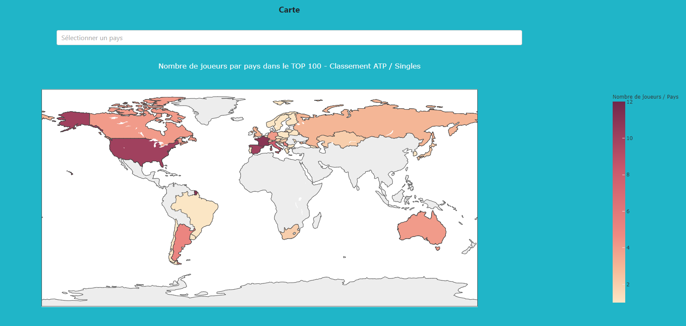

# Web Application - Scraper Tennis <a href="https://www.esiee.fr/">  </a>

Projet ESIEE Paris dont l'objectif est de créer une application Web en utilisant plusieurs *Data Engineer Tools*.

## Table des matières

 - [Introduction](#introduction)
 - [User Guide](#user-guide)
 - [Developer Guide](#developer-guide)
 - [Dashboard](#dashboard)
 - [Data](#dataset)

## 1 - Introduction <a name="introduction" />

### Technologies utilisées

Cette application web est codée en Python, basée sur le package <a href="https://flask.palletsprojects.com/en/1.1.x/">**Flask**</a>.<br>
L'application permet de récupérer des données sur le web en les <a href="https://scrapy.org/">**scrapant**</a>.<br>
Ces données sont ensuite stockées dans une base de données <a href="https://en.wikipedia.org/wiki/Redis">**Redis**</a>.<br>
Enfin, ces données sont affichées à travers un Dashboard interactif réalisé avec le framework <a href="http://dash.plotly.com/">**Dash**</a>.<br>

L'ensemble de l'application est déployée grâce à la technologie <a href="https://www.docker.com/">**Docker**</a>.

### Thème choisi

Les données utilisées par cette application sont les classements des joueurs de tennis mondiaux en tournois simples (*singles*) et en tournois doubles (*doubles*). Ces données sont issues du site officiel https://www.atptour.com/ et sont scrapées à chaque démarrage de l'application directement depuis les adresses suivantes :

- https://www.atptour.com/en/rankings/singles
- https://www.atptour.com/en/rankings/doubles

Les divers éléments tirés de ces classements sont revisités à travers le dashboard pour faire apparaître de nouvelles informations qui n'étaient pas visibles explicitement sur le site d'origine.

## 2 - User Guide <a name="user-guide" />

### **Installation**

*Installer python au préalable sur la machine utilisée (version 3+).*

### Télécharger le Projet

Si vous avez l'habitude d'utiliser <a href="https://git-scm.com/">Git</a>, utilisez la commande suivante :

`git clone https://github.com/Martin-Moritz/Scraper-Tennis.git`

Sinon, téléchargez simplement le dossier du projet en format .zip depuis cette page avec **Code -> Download ZIP**

### Docker

Cette application doit être déployée en utilisant la technologie Docker. Docker est un outil de virtualisation qui permet de lancer toutes les ressources nécessaires du projet sans demander de nombreuses manipulations.

Pour l'installation de **Docker**, suivez les informations suivantes selon votre système d'exploitation :

- **Windows :** https://docs.docker.com/docker-for-windows/install/
- **Linux :** https://docs.docker.com/engine/install/ubuntu/ puis installez **Docker Compose** : https://docs.docker.com/compose/install/
- **MacOs :** https://docs.docker.com/docker-for-mac/install/

Vous pouvez suivre la page complète de démarrage avec Docker sur la <a href="https://www.docker.com/get-started">page d'installation de Docker</a>.

### **Utilisation**

*Après avoir téléchargé le dossier du projet et installé Docker (voir ci-dessus) :*

**Lancez l'application en suivant les étapes suivantes :**

- Ouvrez l'invite de commandes

##### Ouvrir l'invite de commandes

> *Windows* et *Linux* : chercher en tapant '*terminal*' dans la barre de recherche.

- Placez-vous à la racine du projet

##### Se placer dans le dossier du projet

> Utiliser la commande `cd <chemin du répertoire>`<br>
> par exemple : 'cd Desktop/scraper-tennis'

- Démarrez Docker si ce n'est pas déjà fait (à l'aide de *Docker Desktop* par exemple)

- Installez les ressources nécessaires en exécutant la commande `docker-compose build`

Si c'est la première fois que vous exécutez cette commande, le téléchargement pourra prendre quelques minutes.

A la fin, si tout se passe bien, vous pourrez observer ces deux lignes  :

```
Successfully built 35afec8ab936
Successfully tagged scraper-tennis_web:latest
```

- Exécutez la commande `docker-compose up` pour démarrer l'application

- Attendez quelques instants le chargement de l'application

- Ouvrez votre navigateur internet et affichez le dashboard <a href="http://127.0.0.1:5000/">ici</a> (l'application fonctionne à l'adresse http://127.0.0.1:5000/)

- Appuyez CTLR+C dans le terminal pour quitter l'application :

```
Gracefully stopping... (press Ctrl+C again to force)
Stopping scrapertennis_web_1   ... done
Stopping redis_tennis          ... done
```
## 3 - Developer Guide <a name="developer-guide" />

#### Architecture du projet

Le projet est constitué de :

- 4 dossiers :

  - **app** : contient le code du dashboard (application web flask).
  - **data** : c'est ici que sont stockées toutes les données.
  - **newscrawler** : contient le code du scraper pour récupérer les données sur le web.
  - **images** : contient les images utilisées dans ce README.

* 5 fichiers :

  * **docker-compose.yml** : permet de définir les services qui composent l'application afin de les exécuter dans un environnement isolé.
  * **Dockerfile** : permet de construire l'image Docker en exécutant les étapes décrites dans ce même fichier.
  * **main.py** : fichier python permettant de faire tourner l'application (scraper + base de données + dashboard).
  * **requirements.txt** : liste des modules/packages utilisés dans cette application.
  * **README.md**

#### Architecture du dossier **app**

Le dossier *app* est constitué d'un dossier *pycache* (= version compressée des modules python afin d'accélérer leur chargement) et de 7 fichiers python :

- **init.py** : permet de créer l'application *flask*.
- **callbacks.py** : contient les fonctions qui permettent d'obtenir des graphiques interactifs.
- **dash.py** : permet de convertir l'application *flask* en une application *Dash*, permettant ainsi la création du dashboard.
- **data.py** : contient le code permettant de trier et d'utilsier les données contenues dans le dossier .data
- **figures.py** : contient les fonctions qui créent les différentes figures et graphiques du dashboard.
- **layout.py** : contient le code permettant de disposer les différents composants et figures sur la page, déterminant ainsi l'aspect du dashboard.
- **navbar.py** : contient le code déterminant l'aspect de la barre de navigation située en haut de la page.

#### Fonctions des différents fichiers

- **callbacks.py** :
  - *update_carte(selected_countries, selected_classement)*
  > Met à jour la carte choroplèthe en fonction des pays choisis dans le menu déroulant, ainsi qu'en fonction du type de classement choisi (singles ou doubles).

  - *update_histogramme(selected_classement)*
  > Met à jour l'histogramme en fonction du type de classement choisi (singles ou doubles).

  - *update_diagramme(selected_classement)*
  > Met à jour le diagramme en barres en fonction du type de classement choisi (singles ou doubles).

  - *update_link(selected_classement)*
  > Met à jour le lien vers ATP Tour en fonction du type de classement choisi (singles ou doubles).

  - *update_dropdown(selected_classement)*
  > Permet de mettre à jour les choix des joueurs et pays disponibles dans les menus déroulant selon le type de classement choisi (singles ou doubles).

  - *update_classement(selected_players, selected_classement)*
  > Met à jour le classement selon le type de classement (singles ou doubles) ainsi que selon les joueurs choisis dans le menu déroulant.

- **figures.py** :
  - *create_carte(df, pays, values, focus='world', type='Singles')*
  > Crée la carte choroplèthe avec le dataframe et les autres paramètres donnés en argument.

  - *create_histogramme(df, x, type='Singles')*
  > Crée l'histogramme avec le dataframe et les autres paramètres donnés en argument.

  - *create_diagramme(df, x, y, type='Singles')*
  > Crée le diagramme en barres avec le dataframe et les autres paramètres donnés en argument.


#### Architecture du dossier **data**

Le dossier *data* est constitué de :

- un dossier **redis**, qui contient la sauvegarde de la base de données redis.
- un fichier **pays.csv**, utilisé pour convertir en français le nom de pays retrouvés dans les données récupérées scrapées sur le web.
- un fichier **redis.py** qui contient le code permettant d'initiliser et de stocker les données dans la base de données *redis*.

#### Architecture du dossier **newscrawler**

Le dossier *newscrawler* est constitué de :

- un dossier **newscrawler** qui contient l'ensemble des composants du scraper (spiders, items, pipelines, etc.).
Ce scraper a été créé avec la commande *scrapy* suivante : `scrapy startproject newscrawler`
- un fichier **run_spider.py** qui contient le code permettant de scraper les données sur le web.
- un fichier **scrapy.cfg** qui contient les paramètres de déploiement du scraper.


## 4 - Dashboard <a name="dashboard" />

Sur le dashboard sont affichés des graphiques permettant d'illustrer les données tirées du site <a href="https://www.atptour.com/">ATP Tour</a>.

En haut de la page se trouve une barre permettant de choisir d'afficher les données correspondant au classement de tennis en tournois **simples** (*Singles*) ou en tournois **doubles** (*Doubles*).


Un bouton "ATP Tour" permet d'aller sur le site officiel de l'ATP et de comparer en temps réel les informations affichées sur le dashboard avec le classement du site.

Se trouve ensuite le classement des joueurs avec leurs informations respectives telles qu'elles peuvent être retrouvées sur le site de l'ATP.


Il est possible de sélectionner les joueurs affichés grâce au menu déroulant placé au-dessus.

En-dessous, on observe deux graphiques : l'un permet de distinguer la répartition de l'âge des joueurs présents dans le classement, l'autre compare les points des 10 premiers joueurs du classement.


Enfin, une carte permet d'évaluer le taux de présence des différentes nationnalités du classement.



## Data <a name="dataset" />

- Données scrapées sur le web :

  * https://www.atptour.com/en/rankings/singles (pour le classement de tennis en tournois simples)
  * https://www.atptour.com/en/rankings/doubles (pour le classement de tennis en tournois doubles)

- Données secondaires (utilisées pour avoir les noms des pays et des continents en français) :

  - https://sql.sh/ressources/sql-pays/sql-pays.csv
  - https://pkgstore.datahub.io/JohnSnowLabs/country-and-continent-codes-list/country-and-continent-codes-list-csv_csv/data/b7876b7f496677669644f3d1069d3121/country-and-continent-codes-list-csv_csv.csv
